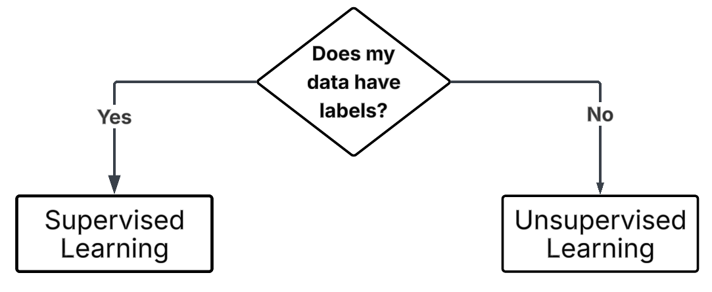
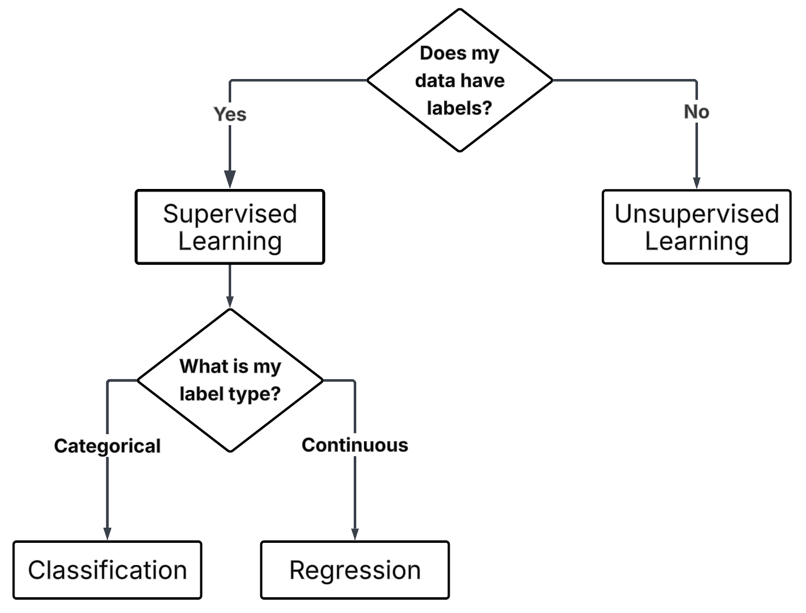
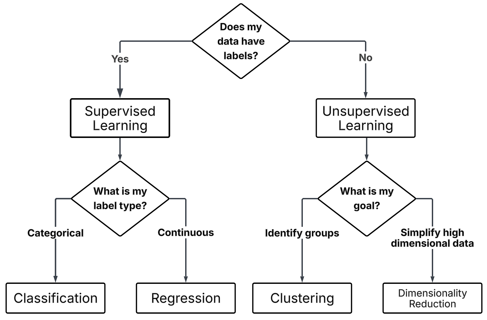

::: questions

- How can I determine what type of problem my data is suited for?
- How do I know what is an appropriate question for a machine learning model to answer?
- How can I clearly define a machine learning problem?

:::

::: objectives

- Articulate a clear and measurable AI/ML problem definition
- Identify whether a task is supervised or unsupervised
- Distinguish between classification and regression tasks
- Distinguish between clustering and dimensionality reduction tasks
- Use appropriate machine learning terms when framing a problem

:::

## Introduction

In the previous session, we explored (and ideally ran) a working example of a machine learning (ML) project. This provided a sense of what ML can do and the typical stages involved in building, training and evaluating a ML model. 

Now, we take a step back and ask: **how do we get to that point?**

Before we can build a solution, we need to define the problem. That means deciding what we want ML to achieve. Ideally, we want to **harness tasks that computers are exceptionally good at**, such as spotting patterns in massive datasets, performing millions of calculations quickly, or consistently applying the same rules without fatigue.

However, computers (and ML) are **not good at everything**. They struggle with tasks requiring common sense, deep contextual understanding, or handling messy, ambiguous problems without clear definitions. 

Just because computers can do things human can't doesn't mean they can do things human's find simple; this distinction is not always obvious if you’re just starting out.

 

  
*“Tasks” by Randall Munroe, [xkcd.com/1425](https://xkcd.com/1425), used under [CC BY-NC 2.5](https://creativecommons.org/licenses/by-nc/2.5/).*

For example:

- You could ask your phone to **detect duplicate photos in your gallery**, even if they’re slightly resized or compressed — a task that could take a person days to do accurately by eye (**computers are great at precise, large-scale comparisons, humans not so much**).

- But to asking your phone to **pick out the photo that best captures the mood of a family gathering**, becomes almost impossible for a computer as without complex definition and training it has no natural sense of emotional relevance in photos (**intuitive for humans, baffling for machines**).

So part of defining your ML problem is figuring out **whether it plays to these computational strengths**, or whether it risks tackling something machines are fundamentally ill-suited to handle.

A good starting point is accurately defining the problem. We can begin by asking...

## How Can We Articulate the Problem?

A well-structured ML problem should be:

- **Clear**: The question should use precise, unambiguous language that explicitly defines the objective.
- **Measurable**: The problem must involve inputs and outputs that are well-defined, observable, and quantifiable.
- **Feasible**: The required data should exist (or be collectible), be accessible, and be sufficient in both quality and quantity.
- **Appropriate**: The question should align with the kinds of problems ML can solve, typically involving prediction, classification, or pattern recognition.
- **Ethically Responsible**: The question should avoid discriminatory inputs and must not reinforce bias or result in harm.

> This is not an exhaustive checklist. Other factors, such as the scope, reproducibility, or specific project priorities, may also be important. If you're unsure, don't hesitate to ask for guidance.

We can consider some examples to better understand why these factors are important.

 

### Is the question clear?

**Example Question:**

### **"Can we use AI to look at diseases in crops?"**

::: spoiler
### ❓ What might we want to change?

- The task is vague – "look at" doesn't describe a specific ML task.  
- "Diseases in crops" is broad – which disease? which crops?  
- It's difficult to interpret and action meaningfully.
- This isn't a bad 'starting place' just a bad 'finishing place'

:::

::: spoiler
### ✅ What could we add?

-**"Can we predict the presence of _leaf rust_ in _wheat crops_ using _drone image data_?"**

**Why it's better:**  
- Specifies the task: *predict the presence* of a disease.  
- Identifies a specific disease (*leaf rust*) and crop (*wheat*).  
- Defines the data source (*drone image data*).  
- These elements narrow the focus, resulting in a much clearer objective.

:::

 

### Are the features measurable?

**Example Question:**

### **"Can we predict how bad a patient's tumour is?"**

::: spoiler
### ❓ What might we change?

- "bad" does not have a precisely defined range  
- If the output lacks consistent, measurable categories then it is unsuitable for model training

:::

::: spoiler
### ✅ What could we add?

- **"Can we classify tumour types from MRI scans (benign vs malignant)?"**

**Why it's better:**  
- Defines a binary, clearly labelled classification task.  
- Uses structured input data (MRI scans).  
- Aligns with typical medical data used in supervised learning.

:::

 

### Is the data needed feasible?

**Example Question :**

### **"Can we predict oak tree health from the tree's number of green vs non-green leaves?"**

::: spoiler
### ❓ What might we change?

- Leaf colour counts are difficult to collect consistently at scale.
- What about leaves that are half green? or yellowy-green?
- Assumes the existence of data that may be unreliable, unavailable or volatile.  
- No indication of how the data would be collected or validated.

:::

::: spoiler
### ✅ What could we add?

- **"Can we predict oak tree health from labelled phenotypic data collected by forestry personnel?"**

**Why it's better:**  
- Relies on structured, expert-collected phenotypic data  
- Improves feasibility through realistic data access  
- More likely to meet the quality and quantity needs of ML

:::

 

### Is the question appropriate for ML models?

**Example Question :**

### **"Can AI determine which music is the best?"**

::: spoiler
### ❓ What might we change?

- "Best" is subjective and lacks a ground truth label  
- The question is not suitable for objective modelling with ML

:::

::: spoiler
### ✅ What could we add?

- **"Can our model recommend new music based on a user’s preferences using track features such as tempo and key?"**

**Why it's better:**  
- Uses measurable inputs (e.g., tempo, key) and labelled preferences  
- Frames the task as a recommendation problem, which aligns well with ML  
- Avoids subjectivity by focusing on data-driven feedback

:::

 

### Are there ethical implications to consider?

**Example Question :**

### **"Can we stream children into sets based on their predicted academic ability using their postcode?"**

::: spoiler
### ❓ What might we change?

- While technically feasible, this raises serious ethical concerns  
- Postcode is a proxy for socioeconomic status and may encode structural bias  
- Using it could reinforce inequality or lead to discriminatory decisions

:::

::: spoiler
### ✅ What could we add?

- **"Can we identify regions where additional educational resources are most needed?"**

**Why it's better:**  
- Shifts focus from labelling an individual to supporting a community  
- Frames the task in a socially constructive way  
- Avoids using sensitive features that could propagate bias

:::

 

### Be mindfull

These are the kinds of considerations you need to make when defining your problem. One important thing to keep in mind...

::: discussion

### ⚠️ "Just because you can, doesn't mean you should"

One of the most important, and often overlooked, questions in ML is:  
**Who or what is this model helping?**

Technical feasibility is only one part of the equation. Responsible AI begins with responsible questions. AI is a tool, how we use it is up to us.

:::

 

::: challenge

### 📝 Breakout Task: Reflect on Your Problem Definition

- Discuss with those around you:  
  - What does your problem definition look like at this point?  
  - Have you adjusted or refined it since starting this session?  
  - Is there anything new you might need to consider (e.g., clearer objectives, feasibility, ethical implications etc.)?

Be prepared to share one insight or question with the group.

:::

 

---

 

## Considering Data Format

We are moving on to understanding your data and the first thing to consider is **how your data is stored and structured**? Understanding your data’s format early helps avoid surprises (like trying to feed raw text into a model that expects numerical arrays).

The **format of your data** has a big impact on:

- How you load it into your analysis environment
- What kind of preprocessing you’ll need
- Which libraries or ML tools are appropriate
- How computationally demanding your pipeline might be

 

### 📚 Common data formats

| **Data Format** | **Examples**                | **Typical considerations**                          |
|-----------------|----------------------------|----------------------------------------------------|
| **Tabular**     | CSV, Excel                 | Check column consistency, delimiters, missing data |
| **Free text**   | Surveys, articles, tweets  | Requires cleaning: tokenisation, stopwords removal |
| **Images**      | JPEG, PNG, TIFF            | Resize, normalise, convert to arrays               |

 

::: callout

### 📝 Breakout Task: Quick questions to understand your data format
- Is your data tabular, text, images, or something else?
- How will you load it? 
- Does it require special libraries or custom parsing?
- What does one data point look like?
- Does it need modifying before analysis?

:::

 

## The Data in Context

Now that we have begun to understand what makes a good machine learning question, we must ensure that our **data aligns with that question**. A model’s performance often suffers not due to algorithm choice, but because of a mismatch between the question being asked and the data being used to answer it.

  
*“Best Selling Product” by Piotr Kononow, [dataedo.com/cartoon/best-selling-product](https://dataedo.com/cartoon/best-selling-product), used under [CC BY-NC 2.5](https://creativecommons.org/licenses/by-nc/2.5/).*

 

::: callout

### 💡 "Understand Your Data, or Misunderstand Your Results"

- **The better we understand our dataset, the more confidently we can select and apply the appropriate ML approach.**

This includes knowing **where** the data came from, **why** it was collected, **how** it was gathered, and **what** its limitations are.

**Not all datasets are created equal**. The origins and context of your data strongly influence what kinds of approaches you can take.

:::

### "But wait... there is nothing I can change about my data now?"

 

::: discussion

### ⚠️ "Overlook the Context, Inherit the Consequences"

In many real-world scenarios we begin with data that has already been collected, often for a different purpose than the one we now intend to explore.

Ideally, we might design a data collection process tailored to our machine learning goals. But in practice, we are often working retrospectively, trying to understand what can be discovered from the data we already have, without the option to amend, expand, or recollect it.

If you are generating synthetic data or designing a future collection process, you’ll have more control. But for the purpose of this session, we assume:

> **It's true that the data is fixed.**  
> It has already been collected, and we cannot influence how, why, or from whom it was gathered. However, this context has significant implications for the entire machine learning process, as it shapes what can be modelled, how results should be interpreted, and where caution must be applied.

:::

 

### Key Questions to Ask About Your Data

These questions build directly on our earlier criteria for good problem formulation. They help you assess how the **origin and structure of your data** may shape what you can realistically model.

::: spoiler
### 1. Who collected the data?

- Was it you, your team, or a third party?
- If external: Is the source reputable (e.g., academic, government, commercial)?
- Is the collector contactable?

> The more we know about who collected the data, the more we can judge how trustworthy and appropriate it is for our task.

::: 

::: spoiler
### 2. How was the data collected?

- Was it gathered via surveys, sensors, web scraping, manual input, or experiments?
- Was the process automated or did it rely on subjective human judgment?
- Are there known issues such as selection bias or noise?

> The collection method shapes the reliability, completeness, and consistency of your dataset.

:::

::: spoiler
### 3. Why was the data collected?

- Was it collected for scientific research, business operations, legal compliance, or another reason?
- Was it designed to answer the question you're asking, or are you repurposing it?

> The original purpose influences how well the data matches your intended ML task.

:::

::: spoiler
### 4. When and where was it collected?

- Is the data recent and representative of current conditions?
- Could location or time-specific events affect its generalisability?

> For example, a model trained on pre-COVID mobility data may not reflect current behaviours.

:::

::: spoiler
### 5. Is the data documented?

- Is there meta data explaining the columns and values?
- Are the units, formats, and variable names clearly defined?
- Is the treatment of missing values transparent?

> Good documentation reduces the risk of misinterpretation and helps support your pre-processing steps.

:::

 

### Examples of how Data Context Shapes ML Pipeline Decisions

Scenario 1:
You have been given a large dataset on customers eating habits collected as part of a health food company’s loyalty card programme.

::: spoiler
### ⚠️ Risks

- The data mainly represents customers already interested in buying healthy products.
- It may not generalise to the broader population’s eating habits.

:::

::: spoiler
### ✅ How to work with it

- Restrict your analysis to questions about *this customer group*.
- Clearly note the demographic limitation in any reports.
- If recorded in the data you could inspect the demographic to better understand the participant makeup.

:::

 

Scenario 2:
You’re given a series of air quality readings from low-cost sensors mounted onto city buses.

::: spoiler
### ⚠️ Risks

- The data is biased towards higher pollution hotspots, missing residential areas or parks.
- Could misrepresent overall city air quality.
- How reliable are the sensors?

:::

::: spoiler
### ✅ How to work with it

- Frame your project around *high-traffic pollution monitoring*, not general air quality.
- Use this data to identify peak exposure zones for traffic planners, rather than claiming citywide averages.
- Could be combined with bus routes to understand the data better.
- Can you find documentation reporting the error range of the sensors?

:::

 

Scenario 3:
You’re analysing water consumption data from a chain of hotels, you discover the data was all collected between May and September.

::: spoiler
### ⚠️ Risks

- It may reflect heavy tourist usage, not typical yearly demand.
- Are the hotels in hot climates? Are they refilling their pools?

:::

::: spoiler
### ✅ How to work with it

- Use the data to study peak scenarios.
- Avoid generalising to average annual water needs unless you can adjust using known seasonal factors.

:::

 

Scenario 4:
You receive a weather dataset and the columns named `Rate`, 'rate2', `Wind`, `Temp`... with no clear documentation, you believe you can deduce their meaning from the context of the dataset.

::: spoiler
### ⚠️ Risks

- You might misinterpret what these columns mean — e.g. thinking `rate` is a rate of increase when it is a rate of decrease.
- Data could be redundant (duplication) which is difficult to confirm if you don't understand the columns.
:::

::: spoiler
### ✅ How to work with it

- Conduct exploratory analysis to check plausible ranges (e.g. your data is for a weather station in Aberystwyth and 'temp' rarely goes above 20 and has never gone above 35, probably safe to assum it is in Celsius).
- Cross-reference any example records or outputs you can find.
- Document all working assumptions
- Speak to the collectors (if possible)

:::

 

::: challenge
### 📝 Breakout Task: Consider your data's context

- With the people around you, discuss:
  - Who collected your data, and why?
  - How was it collected — and could that process introduce bias or gaps?
  - When and where was it gathered — does that affect how generalisable it is?
  - Is the documentation clear, or do you have questions about what columns mean?
  - If none of these risks are relevant, why not? and are there any risks that are?

Try to identify at least **one risk or limitation** in your data’s context that might influence your machine learning pipeline (e.g., needing extra cleaning, restricting your conclusions, or choosing fairness-aware metrics).

Be ready to share your observations.

:::

---

## Framing your Problem

Next it is a good idea to **frame our question**. This means working out exactly **what kind of machine learning problem we’re trying to solve** so we can communicate it clearly, both to ourselves and to others who understand ML.

 

### 🕒 Terminology Time

Let’s start with two important terms in machine learning:

#### **Features**
Features are the individual pieces of information that you use to help make predictions. They are the **inputs** to your model.

**Examples:**

- The length and width of flower petals  
- A person’s age, height, and cholesterol level  
- A pixel value

#### **Labels**
Labels are the **answers you’re trying to predict or explain**.

**Examples:**

- The type of flower (iris setosa, iris virginica, etc.)  
- Whether a patient has a disease
- Is this image a cat?

#### 📚 Also known as...

| **ML Term** | **Also Called** |
|-------------|-----------------|
| Feature     | Input, variable, independent variable, attribute, predictor, **X** |
| Label       | Target, outcome, response, dependent variable, ground truth, class, **y** |

 

### But wait… what if I don’t have labels in my dataset?

That's fine, this is a critical question that will start to shape your entire project.

 

### Supervised and Unsupervised Learning.

Before we choose an algorithm, we need to answer:

 

::: discussion
### "Are we dealing with supervised or unsupervised learning?"

{alt='Flow Diagram for determining supvervised vs unsupervised'}.

:::

 

### **Supervised Learning**

 

You already **have the answers** (the labels). The goal is to teach the model to predict the correct label given new data.

**Example:**
- A botanist has recorded the length and width of flower petals and also classified each flower’s species.  
- Your question: *Can we predict the species of flower based on petal length and width?*

Supervised learning is used when:

- You have data that includes both **inputs (features)** and **known outputs (labels)**.
- You want to see how well you can predict a known outcome from the inputs.

 

### **Unsupervised Learning**

 

You **do not have labels**. The goal here is to explore your data and uncover hidden patterns or groupings.

**Example:**
- You measured the length and width of many flower petals from a region, but don’t know their species.  
- Your question: *Can we find natural groupings (clusters) in the data that might correspond to different flower species?*

Unsupervised learning is used when:

- You only have **input data (features)** and want to discover relationships, structures, or clusters that you didn’t know about beforehand.

 

---

 

### Ok I'm Interested in Supervised Learning, Now What?

 

### 🕒 Terminology Time

| **Label Type** | **Description**                                 | **Example Values**          | 
|----------------|-------------------------------------------------|-----------------------------|
| Categorical    | Data divided into distinct groups or categories | `['Yes', 'No']` or `['UK', 'France', 'Spain']` |
| Continuous     | Numeric data that can take on any value within a range (measurable quantities) | `3.5`, `98.6`, `12.0`, `4.2` |

 

If we are dealing with **supervised learning**, the next question is:

 

::: discussion
### "Are our labels describing categories or quantities?"

{alt='Diagram distinguishing classification and regression tasks'}.

:::

 

### **Classification**

 

You want to predict **which category** something belongs to.

**Example:**
- Given features like flower petal length and width, predict whether the flower is a *setosa*, *versicolor*, or *virginica*.

Classification is used when:

- Your **labels are categorical** (belonging to distinct groups or classes).
- The task is to assign inputs to discrete categories.

> **Note:**  
> There are different sub-types of classification (e.g., binary vs multiclass vs multilabel) to describe different kinds of classification. 

 

### **Regression**

  

You want to predict a **numeric value**.

**Example:**
- Given petal length, predict the **petal width**.

Regression is used when:

- Your **labels are continuous numerical values**.
- The task is to predict quantities that can take on a range of values.

 

---

 

### Ok I Know I'm Doing Unsupervised Learning, Now What?

 

### 🕒 Terminology Time

| **Unsupervised Task**     | **Description**                                                                 | **Typical Goal**                      |
|---------------------------|---------------------------------------------------------------------------------|---------------------------------------|
| Clustering                | Grouping data points based on similarity (no predefined labels)      | Discover hidden groupings or patterns |
| Dimensional Reduction   | Simplifying data by reducing the number of features | Visualisation or Understanding        |

 

If we are dealing with **unsupervised learning**, the next question is:

 

::: discussion
### "Are we trying to group similar things, or reduce complexity?"

{alt='Diagram showing difference between clustering and dimensionality reduction'}.

:::

 

### **Clustering**

 

You want to find **groups or clusters** in your data.

**Example:**
- You analyse a series of petal lengths and widths to determine if there are **distinct groups** within the data.

Clustering is used when:

- You have **unlabelled data**.
- You suspect some structure or grouping exists and want the algorithm to **discover it for you**.

 

### **Dimensionality Reduction**

 

You want to **simplify your data** by reducing the number of features, while preserving important structures or relationships.

**Example:**
- You have 100's of features about petals you believe they are not all important and you want to **reduce** the overall number of features.

Dimensionality reduction is used when:

- Your dataset has **many features**, and you want to:
  - Visualise it more easily
  - Reduce noise or redundancy
  - Speed up future modelling

> You can think of it as **compressing data to keep the most important patterns**.

 

## Challenges

 

::::::::::::::::::::::::::::::::::::: challenge

## 🦞 Problem Scenario 1

New UK fishing legislation has forced boats to release lobsters under a certain weight. However, **weighing lobsters on a boat is costly and cumbersome**, so the fishing industry is exploring more efficient ways to gauge lobster weight.

A dataset from a group of marine biologists in Canada includes the length and weight of thousands of lobsters caught along various parts of the coastline. They want to know if this existing data could be used to estimate the weight of a lobster from its length, as length is more easily captured through pre-existing on-board imaging systems.

**What type of ML problem is this?**  
- Supervised or Unsupervised?  
- Classification, Regression, Clustering, or Dimensionality Reduction?  
- What are the inputs and outputs?

**Also discuss:**
- What might a clear problem definition look like?
- What considerations do we need to give the data?

:::::::::::::::: solution

- ✅ **Supervised Learning**  
- ✅ **Regression** — because the task is to predict a continuous numeric output (weight) from an input (length).  
- **Inputs (features):** lobster length  
- **Output (label):** lobster weight

### A clear problem definition could be:
> "Can we predict the weight of a lobster based on its length measurements using a regression model trained on historical length-weight data from Canadian lobster populations?"

### Data considerations:
- The data comes from Canadian lobsters, so we should check if **growth patterns are similar for UK lobsters**, or if a local dataset is needed for best accuracy.
- Ensure the data covers the **full range of sizes relevant to UK fishing regulations**, or risk poor predictions at critical cutoffs.

:::::::::::::::::::::::::
:::::::::::::::::::::::::::::::::::::::::::::::

 

::::::::::::::::::::::::::::::::::::: challenge

🚜 Problem Scenario 2
A group of agricultural researchers have acquired hand written soil data records from several different farms. These logs record moisture, pH, and nutrient levels every week. The researchers hope to discover natural groupings of soil conditions across the region to better target fertilizer treatments.

What type of ML problem is this?

Supervised or Unsupervised?

Classification, Regression, Clustering, or Dimensional Reduction?

What are the inputs and outputs?

Also discuss:

What might a clear problem definition look like?

What considerations do we need to give the data?

:::::::::::::::: solution

✅ Unsupervised Learning

✅ Clustering — because the goal is to uncover natural groupings (clusters) without pre-labelled outcomes.

Inputs (features): sensor measurements (moisture, pH, nutrient levels)

No explicit outputs (labels) since the task is to find structure.

A clear problem definition could be:
"Can we identify distinct clusters of soil conditions based on moisture, pH, and nutrient levels to guide targeted fertilizer application?"

Data considerations:
Individual farmers may have different standards, leading to inconsistencies or mismatches between data.

Instruments may differ between farms and this may also lead to inconsistencies between data sets.

:::::::::::::::::::::::::
:::::::::::::::::::::::::::::::::::::::::::::::

 

### Applying it to your problem

 

::::::::::::::::::::::::::::::::::::: challenge

Take some time to think about your own dataset and research question (or a project you hope to start). Try to use what we've covered in this session to explore:

What type of ML problem is this?

Supervised or Unsupervised?

Classification, Regression, Clustering, or Dimensionality Reduction?

What are your inputs (features) and outputs (labels), if applicable?

How would you write a clear problem definition?

Are there any data context considerations or ethical risks?

Use this exercise to create the first slide of your slide deck.
You will be using your slide to introduce yourself and your problem to the group.

:::::::::::::::::::::::::::::::::::::::::::::::

---

 

::: keypoints
- Defining your problem clearly is a critical step in any ML project. A poorly defined question can lead to poor or even meaningless results.
- Machine learning is best suited for tasks that play to computational strengths (e.g., pattern recognition, scale, consistency).
- A good ML problem is clear, measurable, feasible, appropriate for ML, and ethically sound.
- Developing an understanding of the shared vocabulary is essential for clearly categorising and efficiently discussing your problem type.
- The context of your data is crucial for understanding the limitations of your analysis and the conclusions you can reliably draw.
:::

 

### Final note

 

  
*“Here to Help” by Randall Munroe, [xkcd.com/1536](https://xkcd.com/1536), used under [CC BY-NC 2.5](https://creativecommons.org/licenses/by-nc/2.5/).*

 

> None of this is easy, so try not to get discouraged.  
> Defining a good ML problem, and understanding your data’s limitations, is challenging work.  
> Remember, there is no silver bullet, and we’re here to help you navigate it.
