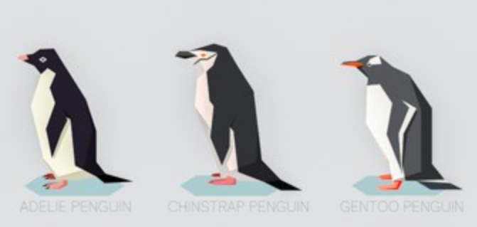

```{r setup-reticulate, include=FALSE}
library(reticulate)
```

::: questions

- What does a machine learning solution look like? 
- How can I solve a problem with machine learning in Python? 

:::

::: objectives

- Understand the typical structure of an ML project
- Run a worked example
- Start to think about what your own solution may look like

:::

<br>

### Time to Dive Right In

We’re going to jump straight into the deep end by running a worked example you’ve already prepared in the summary and setup section. Don’t be intimidated if you don’t understand everything right away, that’s perfectly okay. This is just a high-level pass to give you context and a feel for the overall process. Throughout the week, each session will break down these steps in more detail so you’ll build a deeper understanding as we go.

> Note: For transparency, all scenarios presented in these lessons are entirely fictional and are not intended to be accurate or representative of real-world facts.

<br>

## Scenario: Pick a Penguin 🐧

A team of marine biologists working in Antarctica is keen to **identify penguin species**, as the balance between these species is a critical indicator of climate change and the overall health of marine ecosystems. However, capturing penguins to determine their species is both **costly** and **disruptive to the wildlife**.

To reduce costs and disturbance, they are investigating whether remote camera stations equipped with automated detection algorithms could track and log colonies of penguins without physical handling. As a **first step**, they want to assess how reliably **species can be classified based on observable features**.

**They have already assembled a dataset** containing individual penguins with known species labels, along with associated characteristics such as the island they were found on, bill length and depth, flipper length, body mass, and sex.

<br>

  
*UK Antarctic Heritage Trust, [ukaht.org](https://www.ukaht.org/latest-news/2025/can-you-name-the-18-species-of-penguins/)*

<br>


Based on this dataset, they want to explore the following question:

::: callout
### Problem definition

#### Can **penguin species** (Adelie, Chinstrap, and Gentoo) be accurately **predicted** from **location, bill length, bill depth, flipper length, weight,** and **sex**? Additionally, which of these **features contribute most** to distinguishing between species?
:::

<br>

::: challenge
### Your task

We’ll use this scenario to walk through the typical stages of a machine learning project. Now that we’ve established the problem definition, the next steps on our journey are:
- **Import the data:** Get our tabular penguin data into our environment.
- **Data exploration:** Examine the dataset to understand what it contains and identify any missing or unusual values.
- **Preprocessing:** Clean and prepare the data so that it can be used in a machine learning model.
- **Model selection:** Choose an appropriate algorithm to predict species based on the available features.
- **Training and testing:** Split the data to fairly evaluate model performance.
- **Evaluation:** Assess how accurately your model predicts species and investigate which features are most important.

:::

<br>

---

## Setup

```{python}
# import the libraries we intend to use

import pandas as pd
import matplotlib.pyplot as plt
```

<br>
<br>

## Import the data

```{python}
# use pandas to import our csv datafile
df_peng = pd.read_csv('data/penguins.csv')
```

## Inspect the data

```{python}
# Show me first 10 rows and the shape of the table
print(df_peng.head(10))
print(df_peng.shape)
```

```{python}
# Which features can we insepect the distribtuion?
features = ['bill_length_mm', 'bill_depth_mm', 'flipper_length_mm', 'body_mass_g']

plt.figure(figsize=(12, 8))
# enumerate gives us a numeric value as well as our feature during our loop
for i, feature in enumerate(features, 1): #starting from 1 in our numeric loop
    plt.subplot(2, 2, i) # plot position
    df_peng[feature].hist(bins=10) #create a histogram from our feature with 10 bins 
    # add axis labels
    plt.xlabel(feature)
    plt.ylabel('Count')

plt.tight_layout()
plt.show()
```

## Fix the data

## Training & Test split

## Results 

## Evaluation

